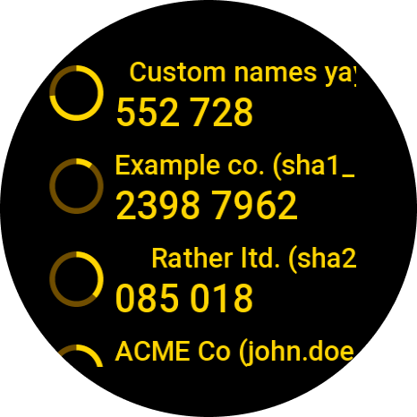
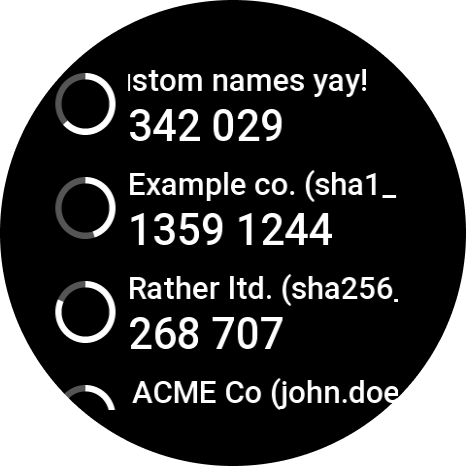
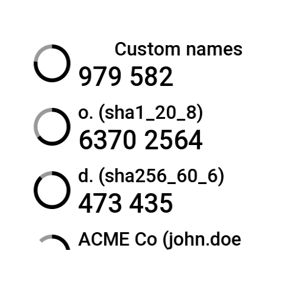
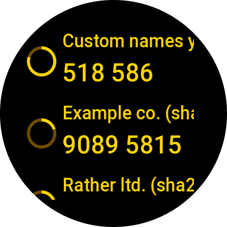
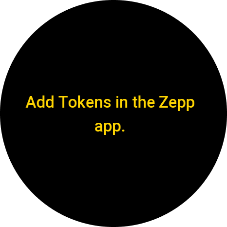

# [zepp-otp-auth-app](https://github.com/remigius42/zepp-otp-auth-app)

Copyright 2026 binary poetry gmbh.

With `zepp-otp-auth-app` you can keep your [time-based one-time passwords
(TOTP)](https://en.wikipedia.org/wiki/Time-based_one-time_password) on your
Amazfit watch. Secrets stay on your phone and are pushed to the watch, which
then generates codes without needing a connection to anything.

This is a port of
[fitbit-otp-auth-app](https://github.com/remigius42/fitbit-otp-auth-app) to
Zepp OS. It is **work in progress** and not yet released.

  
  &nbsp;
  
  &nbsp;
  
  &nbsp;
  
  &nbsp;
  

## Status

| Area        | State                                                                                                                               |
| ----------- | ----------------------------------------------------------------------------------------------------------------------------------- |
| Target      | Amazfit Active 2 (round), API_LEVEL 4.2. Builds also cover the other round Zepp OS devices, since layouts scale from a design width |
| Implemented | Feature parity with the Fitbit app except for the differences below: Token list, Settings App, phone-to-watch Sync, Enrollment      |
| Pending     | Hardware check of the latest fixes, distribution                                                                                    |

## Differences from the Fitbit app

These are deliberate and reasoned; each links to the decision record.

- **No QR enrollment.** Zepp OS has no image picker. Enrollment is manual
  entry or pasting an `otpauth://` URI. Importing export files or QR images is
  left out on purpose, because both keep Secrets unencrypted on the phone —
  [ADR-0001](./docs/adr/0001-local-file-enrollment-no-hosted-scanner.md)
- **Tokens are not stored on the watch.** They live in memory and are synced on
  every connection, so the watch needs your phone in range —
  [ADR-0004](./docs/adr/0004-no-on-watch-token-storage-initially.md)
- **No connection indicator in the settings page.** Zepp exposes Bluetooth state
  to the watch but not to the phone —
  [ADR-0003](./docs/adr/0003-no-phone-side-connection-status.md)
- **Three color schemes instead of six.** The three dropped ones were Fitbit's
  brand palette.

## Documentation

The [documentation site](https://remigius42.github.io/zepp-otp-auth-app/)
collects the manual, the decision records and the porting analysis.

- [User manual](./docs/manual/README.md) ([Deutsch](./docs/manual/de.md))
- [Porting analysis](./docs/porting-analysis/README.md) — what ports, what
  doesn't, and what the platform actually does as opposed to what its
  documentation says
- [Glossary](./CONTEXT.md) — the vocabulary this project uses, and the
  ambiguities it deliberately avoids
- [Decision records](./docs/adr/README.md) — the choices worth not re-litigating

## Contributing

Get started by having a look at [CONTRIBUTING.md](./CONTRIBUTING.md).

## Funding

This project is powered by coffee, therefore I would appreciate if you could

thank you!
